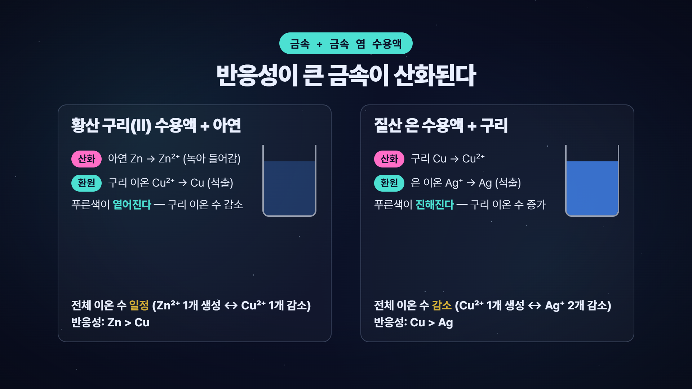

# 0. 이 자료로 무엇이 되는가

## 한 문장으로

> **PDF 수업 자료 한 장을 넣으면, 내 목소리로 설명하는 6분짜리 모션그래픽 수업 영상이 나옵니다.**
> 편집 프로그램도, 코딩 지식도, 비용도 필요 없습니다. 필요한 건 "복사·붙여넣기"뿐입니다.

**완성 영상 보기**: {{VIDEO_URL}}
**자료·예제·프롬프트 전부**: {{REPO_URL}}

{{QR_REPO}}

## 세 가지 도구, 세 가지 동사

| 도구 | 하는 일 | 한마디로 |
|---|---|---|
| **클로드 코드** (Claude Code) | 내 컴퓨터에서 파일을 읽고, 프로그램을 실행하고, 결과를 만들어 주는 AI 비서 | 일꾼 |
| **watch 스킬** | 유튜브·수업 영상을 클로드가 "보고" 내용을 정리 | 보기 |
| **HyperFrames** | 대본에 맞춰 움직이는 모션그래픽 영상을 코드로 만들고 렌더 | 만들기 |
| **Qwen3-TTS** | 내 목소리 12초만 녹음하면 어떤 문장이든 내 목소리로 읽어 줌 | 말하기 |

## 이 자료를 따라 하면

| 단계 | 걸리는 시간 (처음) | 비용 |
|---|---|---|
| 2장 설치 (Node.js·Claude·Python·ffmpeg) | 40~60분 | 0원 |
| 3장 watch, 4장 HyperFrames 설치 | 15분 | 0원 |
| 5장 영상 1편 (PDF → 6분 영상) | 30~60분 (대부분 기다리는 시간) | 0원 |
| 6장 내 목소리 입히기 | 30분 (+ Kaggle 가입 시 20분) | 0원 |

* 클로드 코드는 Claude **Pro 요금제(월 $20)** 이상에서 쓸 수 있습니다. 그 외 모든 도구는 무료·오픈소스입니다.
* 두 번째 영상부터는 **"PDF 주고 30분 기다리기"** 가 전부입니다.

## 예시 영상은 이렇게 만들었습니다

- 입력: 「통과2-1-2 화학변화 (교사용).pdf」 15쪽 중 소단원 1 「산화와 환원」(1~5쪽)
- 출력: 10장면 · 6분 40초 · 1920×1080 · 인트로 포함
- 제작: 대본(클로드 작성, 교사 검토) → 음성(edge-tts → 내 목소리 Qwen3) → 장면(HyperFrames) → 렌더 8분 45초
- 같은 방법으로 나머지 소단원(산·염기·중화 / 에너지 출입)도 각각 한 편씩 만들 수 있습니다.

## 읽는 법

- **회색 상자**는 복사해서 붙여넣습니다. `PS>` 는 PowerShell(파란/검은 명령 창), 말풍선은 클로드 코드 채팅창.
- 캡처 아래 **"이 화면이 나오면 성공"** 이 있으면 거기까지 확인하고 다음으로 갑니다.
- 막히면 **7장**으로. 거기에 없는 문제는 **클로드 코드에게 에러를 그대로 붙여넣고 물어보면** 대부분 풀립니다 (부록 A-15).
