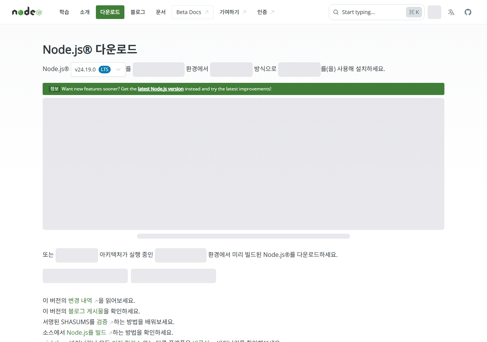
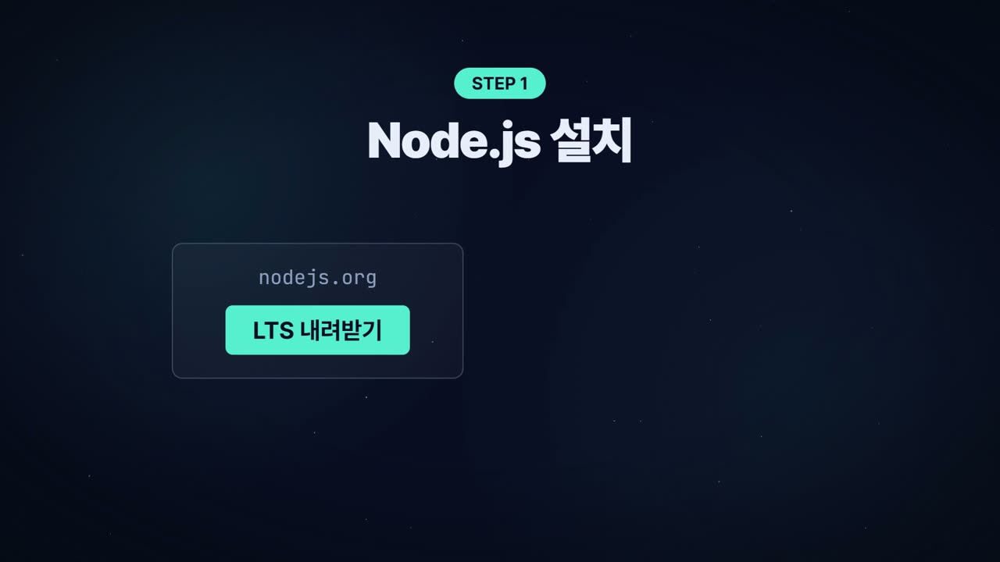
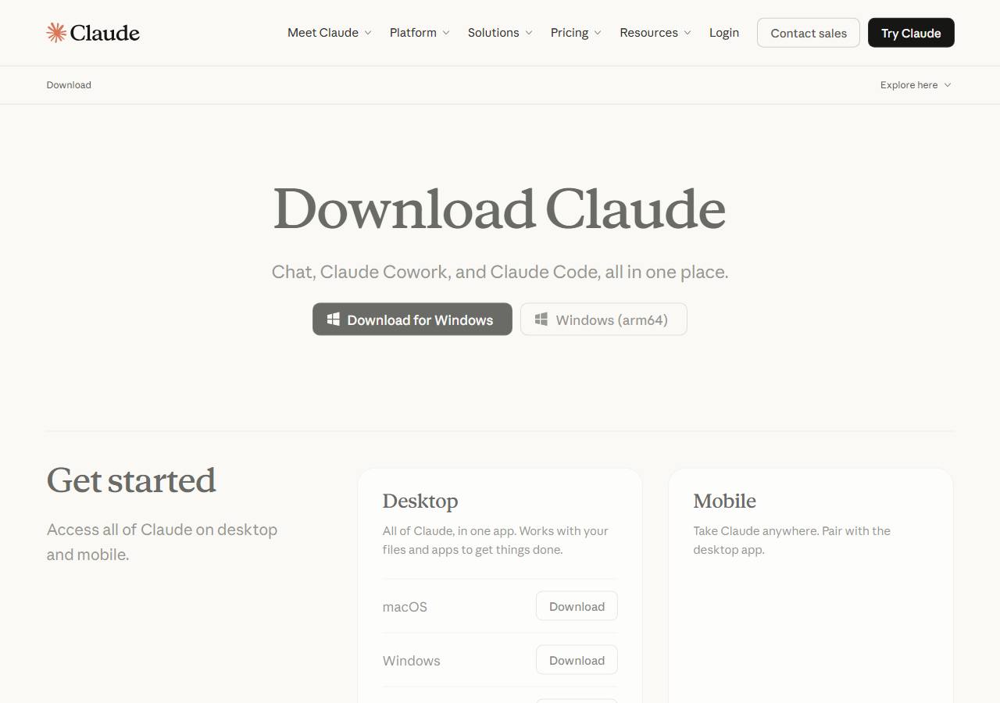
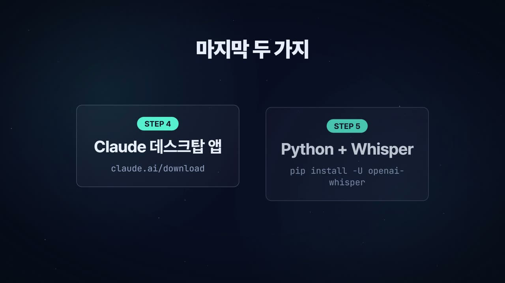

# 2. 클로드 코드 설치 — Node.js → Claude 데스크탑 → 로그인 → 첫 대화

> **목표**: Claude 데스크탑 앱의 "코드" 탭에서 `C:\hyper` 폴더를 열고, 클로드에게 첫 말을 거는 것까지.
> 걸리는 시간 40~60분. 대부분 다운로드 기다리는 시간입니다.


## 2-1. Node.js 설치 (가장 먼저)

Node.js는 3·4장에서 쓰는 `npx …` 명령의 엔진입니다. 이게 없으면 뒤가 전부 막힙니다.

1. 브라우저에서 **https://nodejs.org/ko/download** 접속
2. 초록색 **LTS** 버전의 Windows Installer(.msi) 내려받기
3. 실행 → 계속 "다음" → 기본값 그대로 설치 (체크박스 건드릴 것 없음)





4. **확인**: 시작 메뉴에서 `PowerShell` 검색 → 실행 → 아래 입력 후 Enter

```
PS> node -v
```
**이 화면이 나오면 성공**: `v24.14.0` 처럼 v로 시작하는 숫자. (숫자는 달라도 됩니다. 22 이상이면 충분.)

> ⚠ PowerShell 창을 **설치 전에 열어 두었다면** 닫고 새로 여세요. 새 프로그램은 새 창에서만 보입니다. 이 규칙은 이후 모든 설치에 똑같이 적용됩니다.

## 2-2. Claude 데스크탑 앱 설치 + 로그인

클로드 코드는 따로 설치하지 않습니다. **Claude 데스크탑 앱 안에 "코드" 탭으로 들어 있습니다.**

1. **https://claude.ai/download** 접속 → **Download for Windows**
2. 설치 후 실행 → 평소 쓰는 Claude 계정으로 **로그인** (Pro 이상)



> 계정이 없다면 이 화면에서 만들고, 요금제는 Pro로 올려 두세요. 클로드 코드는 Pro 이상에서만 열립니다.

## 2-3. 작업 폴더 만들기 + 코드 탭 열기

1. PowerShell에서:
```
PS> mkdir C:\hyper
```
2. Claude 앱 왼쪽 메뉴에서 **코드(Code)** 탭 → **로컬** → **폴더 열기** → `C:\hyper` 선택
3. 채팅창에 첫 말을 겁니다 (부록 A-3):

```
안녕! 지금 열려 있는 폴더 경로를 알려주고, 이 컴퓨터에 node, python, ffmpeg, git이 설치돼 있는지 확인해 줘.
없는 게 있으면 어떻게 설치하는지 알려줘.
```

**이 화면이 나오면 성공**: 클로드가 `C:\hyper` 라고 답하고, 네 가지 도구 중 뭐가 있고 없는지 표로 알려줍니다. 이제부터 클로드가 **선생님 컴퓨터에서 직접 명령을 실행**할 수 있습니다 — 실행 전에 "허용할까요?"라고 물으면 내용을 보고 **허용**을 누르면 됩니다.

> 💡 **권한 요청이 귀찮다면** 채팅창 왼쪽 아래 "편집 자동 수락"을 켤 수 있습니다. 처음엔 하나씩 허용하면서 클로드가 무엇을 하는지 보는 것을 권합니다.

## 2-4. Python 설치 + 나레이션 도구

나레이션(음성)을 만들 때 Python 프로그램을 씁니다.

1. **https://www.python.org/downloads/** → **Download Python 3.x** (3.11 이상)
2. 실행 화면에서 **반드시 "Add python.exe to PATH" 체크** → **Install Now**



3. PowerShell **새 창**에서:
```
PS> python --version
PS> pip install edge-tts mutagen pymupdf
```
**이 화면이 나오면 성공**: `Python 3.11.x` 가 나오고, pip 설치가 `Successfully installed …` 로 끝납니다.

- `edge-tts`: 무료 한국어 음성(남/여) — 5장에서 기본 목소리로 씀
- `mutagen`: 음성 길이 측정
- `pymupdf`: PDF 읽기

## 2-5. ffmpeg + git

**ffmpeg** — 영상 합치기·음성 처리의 만능 도구. **git** — 예제 킷을 내려받는 도구.

PowerShell을 **관리자 권한**으로 열어서 (시작 → PowerShell 검색 → 마우스 **오른쪽** → 관리자 권한으로 실행):
```
PS> winget install Gyan.FFmpeg.Shared
PS> winget install Git.Git
```
창을 전부 닫고 **새 PowerShell**에서:
```
PS> ffmpeg -version
PS> git --version
```
**이 화면이 나오면 성공**: `ffmpeg version 8.x …`, `git version 2.x`.

> "찾을 수 없습니다"가 나오면 → 컴퓨터를 한 번 **재시작**하고 다시 확인. 그래도 안 되면 7장.

## 2-6. 여기까지 점검 (부록 A-1)

```
PS> node -v
PS> python --version
PS> ffmpeg -version
PS> git --version
```
네 줄 모두 버전이 나오면 **2장 끝**. 이제 클로드에게 일을 시킬 준비가 됐습니다.

## 2-7. 클로드 코드와 일하는 법 — 딱 세 가지만

1. **폴더를 먼저 연다.** 클로드 코드는 "지금 열린 폴더" 안에서만 일합니다. 항상 `C:\hyper\…` 를 엽니다.
2. **원하는 결과를 말한다, 방법은 맡긴다.** "PDF로 6분 영상 만들어 줘"면 충분. 방법을 몰라도 됩니다.
3. **에러는 그대로 붙여넣는다.** 빨간 글씨가 나오면 읽지 말고 복사해서 "이거 뭐야, 고쳐 줘". 대부분 클로드가 스스로 고칩니다.
