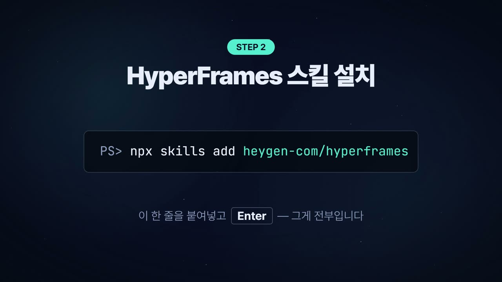
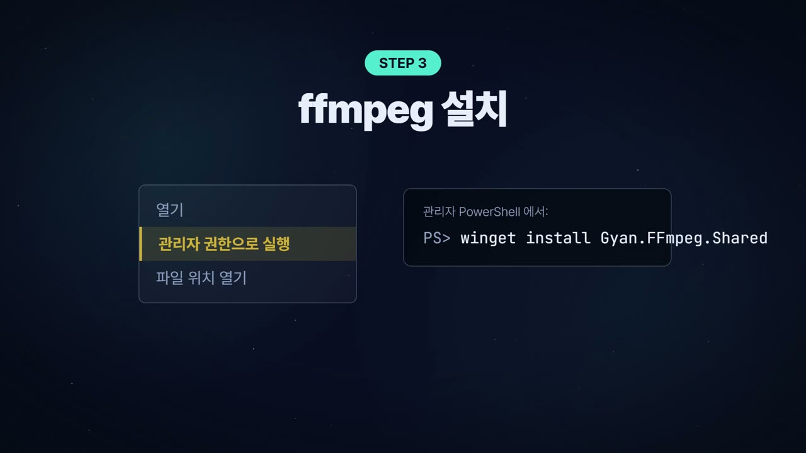

# 3. watch 스킬 — 클로드에게 "눈"을 달아 주기

> **목표**: 영상 파일(또는 유튜브 주소)을 주면 클로드가 장면을 보고 내용을 정리해 주게 만들기.
> 걸리는 시간 10분.

## 3-1. 왜 필요한가

클로드는 글은 읽지만 영상은 못 봅니다. **watch 스킬**은 영상을 받아서(yt-dlp) 장면이 바뀔 때마다 프레임을 뽑고(ffmpeg), 자막이 있으면 글로 가져와서 클로드에게 건네줍니다. 그러면 클로드가 "3분 12초에 칠판에 ○○ 수식이 나온다"처럼 답할 수 있습니다.

수업 준비에서 쓰이는 장면:
- 다른 선생님의 유튜브 수업 영상 구성을 빠르게 파악해 내 대본에 참고
- 학생 발표 영상·실험 영상을 요약
- (이 자료의 설치 장면 그림들도 watch로 뽑았습니다 — 아래 3-3)

## 3-2. 설치 (부록 A-4)

PowerShell에서 `C:\hyper` 로 이동해 한 줄:

```
PS> cd C:\hyper
PS> npx skills add bradautomates/claude-video --agent claude-code --skill watch -y --copy
```

**이 화면이 나오면 성공**:
```
◇  Installed 1 skill
│  ✓ watch (copied)
│    → .\.claude\skills\watch
└  Done!
```
(실제 실행 기록: `captures/03-02-install.txt`)

`npx skills` 는 "스킬 가게"입니다. `skills add 〈저장소〉` 한 줄로 클로드에게 새 능력을 붙입니다. 4장의 HyperFrames도 같은 방법으로 설치합니다.

유튜브 주소를 바로 쓰려면 한 가지 더 (2026년 유튜브 정책 때문에 필요):
```
PS> winget install --id DenoLand.Deno -e
PS> pip install -U yt-dlp
```

## 3-3. 써 보기 (부록 A-5)

Claude 앱 → 코드 탭 → `C:\hyper` 폴더가 열린 상태에서:

```
/watch C:\hyper\source\〈영상〉.mp4  이 영상이 어떤 내용인지 단계별로 요약해 줘. 화면에 나온 명령어가 있으면 적어 줘.
```

실제로 이 자료를 만들 때, 설치 안내 영상(1분 55초)을 watch로 돌린 기록입니다:

```
$ python ".../skills/watch/scripts/watch.py" "C:\hyper\lesson\captures\yt\install_guide.mp4" --resolution 1280

[watch] using local file…
[watch] extracting scene-aware frames over full 115.1s (target 60, cap 100)…
## Frames
- frame_0001.jpg (t=00:00)
- frame_0020.jpg (t=00:36)  ← "Node.js 설치" 카드
- frame_0032.jpg (t=00:59)  ← "npx skills add heygen-com/hyperframes"
…(24장)
```

그리고 클로드가 프레임을 읽고 정리해 준 결과의 일부:

> 0:36 Node.js 설치 → 0:59 HyperFrames 스킬 설치 명령 `npx skills add heygen-com/hyperframes` → 1:11 ffmpeg (`winget install Gyan.FFmpeg.Shared`, 관리자 권한) → 1:24 Claude 데스크탑 + Python·Whisper → 1:46 "재료 넷을 넣으면 편집은 Claude가"





유튜브도 같은 방식입니다:
```
/watch https://www.youtube.com/watch?v=〈영상ID〉  이 수업 영상의 구성(도입·전개·정리)과 핵심 개념을 정리해 줘.
```

## 3-4. 알아 둘 것

- **10분 이하 영상**이 가장 정확합니다. 긴 영상은 "2:30~5:00 구간만" 처럼 범위를 말해 주세요.
- 자막이 없는 영상은 **프레임만** 봅니다 (음성을 글로 바꾸려면 Whisper API 키가 필요 — 없어도 됩니다).
- 유튜브가 403/429로 막히는 날이 있습니다 (2026-08-19에도 그랬습니다). 그럴 땐 영상을 먼저 내려받아 파일로 주거나, 다음 날 다시. 자세한 건 7장.
- 결과 프레임은 임시 폴더에 남습니다. 클로드가 마지막에 경로를 알려 주니, 자료로 쓸 그림이 있으면 복사해 두세요.
