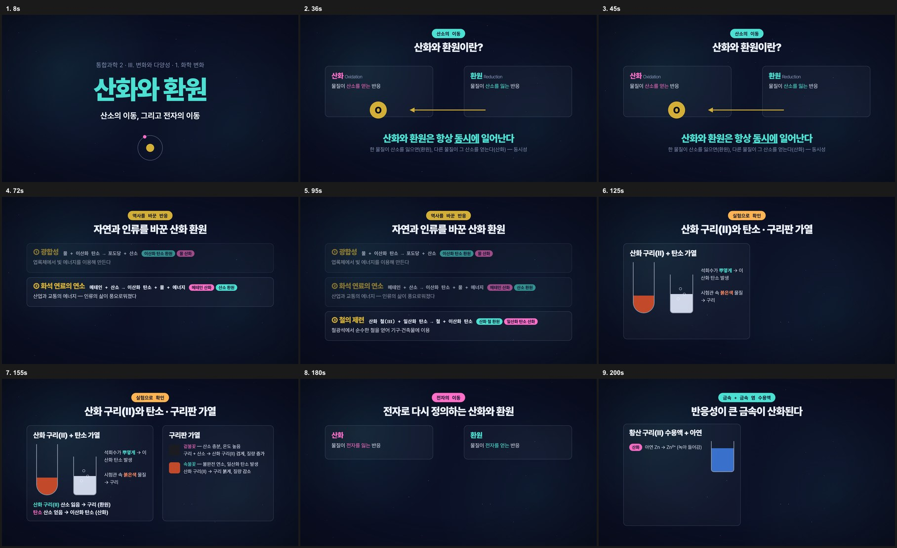
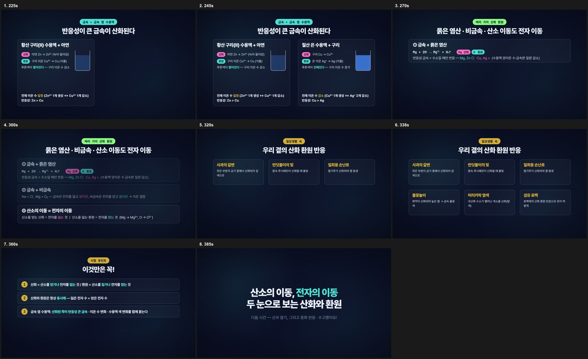
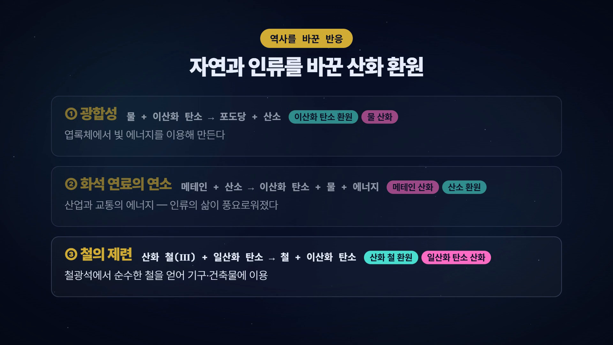

# 5. 영상 제작 실습 — PDF 한 장에서 6분 수업 영상까지

> **목표**: 「통과2-1-2 화학변화 (교사용).pdf」 → 10장면 · 6분 40초 · 기본 목소리(edge-tts) 학습 영상.
> 걸리는 시간 30~60분 (클로드가 일하는 동안 기다리는 시간이 대부분).
> 이 장의 화면은 **전부 이 자료를 만들면서 실제로 찍은 것**입니다.


## 5-1. 준비: 원본 자료를 영문 폴더에

```
PS> mkdir C:\hyper\source
```
탐색기로 `C:\hyper\source\` 에 PDF(와 있으면 인트로 영상)를 복사합니다. 파일명은 한글이어도 됩니다.

## 5-2. 클로드에게 시키기 (부록 A-9)

Claude 앱 → 코드 탭 → **`C:\hyper\lesson` 폴더를 열고** 아래를 붙여넣습니다. `〈 〉` 부분만 바꿉니다.

```
이 폴더는 수업 영상 제작 킷이야. kit/ 폴더의 구조(scripts/make_narration.py, scripts/gen_scenes.py, scripts/wire_index.py, compositions/, index.html)를 먼저 읽어 줘.

내 수업 자료는 C:\hyper\source\통과2-1-2 화학변화 (교사용).pdf 야. 이 PDF를 읽고 아래 조건으로 학습 영상을 만들어 줘.
- 대상: 고1 통합과학, 길이 5~7분
- 장면 8~10개, 장면마다 나레이션 3~5문장 (학생에게 말하는 존댓말 수업 톤)
- 내용·용어·수치는 반드시 PDF에서 가져올 것 (지어내지 않기)
- 마지막에 '시험 포인트' 장면 1개 포함
- 작업은 C:\hyper\chem-redox 폴더에서 (한글 경로 금지)

순서: ① 대본(SCENES) 작성 → ② make_narration.py로 음성 생성 → ③ gen_scenes.py로 장면 만들기 → ④ npx hyperframes check 통과 → ⑤ 스냅샷으로 눈 확인 → ⑥ 렌더 → ⑦ 완성 mp4 경로 알려주기.
대본을 다 쓰면 렌더 전에 한 번 보여 줘.
```

이제 클로드가 단계별로 일합니다. 각 단계에서 **무슨 일이 일어나는지**와 **무엇을 확인하면 되는지**만 알면 됩니다.

## 5-3. ① PDF 읽기 → 대본

클로드가 PDF 15쪽의 글자를 전부 꺼내 읽고(`source_text.md`), 소단원이 3개(산화·환원 / 산·염기·중화 / 에너지 출입)인 것을 파악합니다. 6분 영상에는 **소단원 하나**가 맞으니 「산화와 환원」(1~5쪽)으로 범위를 잡자고 제안합니다.

대본은 `(장면ID, [나레이션 문장들], 여유시간)` 형식으로 10개 장면이 나옵니다. 예:

```
("s02", [
  "먼저 산소의 이동으로 산화와 환원을 정의해 봅시다. 산화는 물질이 산소를 얻는 반응이고, 환원은 물질이 산소를 잃는 반응입니다.",
  "그런데 중요한 건, 이 둘이 항상 동시에 일어난다는 점입니다. … 이것을 산화 환원 반응의 동시성이라고 합니다.",
], 0),
```

**선생님이 할 일 — 대본 검토.** 여기가 교사의 전문성이 들어가는 지점입니다.
- 용어가 교과서와 같은가? ("산화 철(Ⅲ)", "석출", "동시성")
- 빠진 핵심, 과한 설명은 없는가?
- 고칠 게 있으면 그냥 말합니다: "s06 두 번째 문장에서 '이온 수 일정' 이유를 한 문장 더 넣어 줘."

예제 대본 전문은 `kit/script_chem_redox.md` 에 있습니다.

## 5-4. ② 음성 생성 (edge-tts)

클로드가 `python scripts/make_narration.py` 를 실행합니다. 장면·문장별로 mp3 22개가 만들어지고, **실제 길이를 재서** `timing.json` 에 기록합니다.

```
made s01_0 … made s10_0
TOTAL 392.95
s01 0.6   [(0.6, 18.38)]
s02 19.68 [(19.68, 11.09), (31.12, 15.94)]
…
```
**확인 포인트**: `TOTAL` 이 목표 길이(300~420초) 안인가. 길면 "대본을 15% 줄여 줘", 짧으면 "예시를 하나씩 더 넣어 줘".

> 💡 왜 먼저 음성을 만드나요? 화면 요소는 **말이 나오는 순간**에 등장해야 합니다. 그래서 음성 길이를 실측한 뒤 그 타이밍에 맞춰 장면을 짭니다. 기획 단계의 "약 20초"는 거의 항상 틀립니다.

## 5-5. ③ 장면 만들기 → ④ check

클로드가 `scripts/gen_scenes.py` 를 새로 써서 장면 10개(`compositions/s01~s10.html`)를 만들고 `index.html` 에 배선한 뒤 검사합니다:

```
PS> npx hyperframes check
```
**이 화면이 나오면 성공**: `◇ Check passed`. 첫 시도에서 실패하는 경우가 흔합니다 — 이 자료를 만들 때도 처음엔 "텍스트 두 블록이 겹친다" 5건이 나왔고, 클로드가 원인(CSS 중괄호 오타)을 찾아 고친 뒤 통과했습니다. 선생님은 기다리기만 하면 됩니다.

## 5-6. ⑤ 스냅샷으로 눈 확인

check는 "빈 화면"을 못 잡습니다. 그래서 클로드가 여러 시각의 스냅샷을 찍어 한 장에 모읍니다:





**선생님이 볼 것**: 말은 하는데 화면이 빈 구간이 없는지, 글자가 잘리지 않았는지, 색·크기가 보기 편한지. 고칠 게 있으면 말로: "s04 시험관 그림을 더 크게", "s08 카드 글자를 키워 줘".

## 5-7. ⑥ 렌더

```
PS> npx hyperframes render -o out/body.mp4
```
```
  ██████████████░░░░░░░░░░░  59%  Capturing frame 8850/11789 (5 workers)
  …
  78.3 MB · 6m 32.9s video · rendered in 8m 45.1s
```
11,789장의 프레임을 찍고 인코딩합니다. 이 PC(RTX 2070, 16GB)에서 8분 45초. 커피 한 잔.

## 5-8. ⑦ 인트로 붙이기 → 완성 (부록 A-10)

```
완성된 본편 앞에 C:\hyper\source\통과2_화학변화_인트로.mp4 를 붙여서 final.mp4 로 만들어 줘. 해상도 1920x1080, 30fps, 오디오 48kHz로 맞춰서.
```
클로드가 ffmpeg로 두 영상의 해상도·프레임·오디오 규격을 맞춰 이어 붙입니다. 결과 **6분 40초, 1920×1080**.



**완성본 비교**: 기본 목소리(edge-tts) 판은 여기서 끝. 내 목소리 판은 6장에서. 두 판 모두 {{VIDEO_URL}} 에서 볼 수 있습니다.

## 5-9. 두 번째 영상부터

같은 `lesson` 폴더를 열고 5-2의 프롬프트에서 **PDF 경로·대상·폴더 이름만** 바꿉니다. 클로드는 kit와 방금 만든 `chem-redox` 를 참고해 같은 품질로 만듭니다. 영상 한 편 = 폴더 하나(`C:\hyper\〈영문이름〉`)만 지켜 주세요 — 이전 장면이 섞이면 검사에서 안 잡히는 버그가 됩니다.

## 5-10. 자주 하는 조정

| 하고 싶은 것 | 이렇게 말하기 |
|---|---|
| 여성 목소리 | "목소리를 ko-KR-SunHiNeural 로 바꿔 다시 만들어 줘" |
| 더 천천히 | "말 속도를 -5%로" (edge-tts `RATE`) |
| 특정 장면 수정 | "s05 전자 이동 애니메이션에서 전자를 3개로" |
| 배경·색 톤 | "frame.md 의 배경색을 밝은 톤으로 바꾸고 전체 다시" |
| 길이 조정 | "총 5분으로 줄여 줘 — 역사 장면(s03)을 한 문장씩 짧게" |
| 자막 넣기 | "embedded-captions 스킬로 나레이션 자막을 넣어 줘" |
