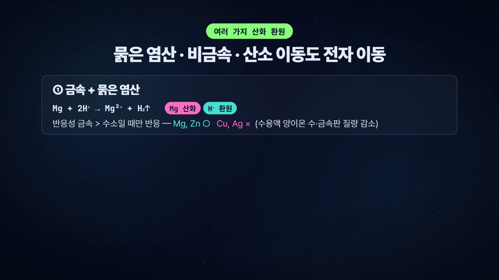

# 6. 내 목소리 입히기 — Qwen3-TTS

> **목표**: 5장에서 만든 영상의 나레이션을 **선생님 목소리**로 바꾸기.
> 6-A(녹음)는 모두 / 6-B(로컬 GPU) 또는 6-C(Kaggle 무료 GPU) 중 하나 / 6-D(교체).
> 걸리는 시간 30분 (+Kaggle 가입 20분).

## 6-0. 왜 내 목소리인가

학생은 "우리 선생님 목소리"에 반응합니다. 같은 내용이라도 기계 목소리보다 집중도가 다르고, 보강·결석생·복습용으로 돌려 볼 때 "수업의 연장"으로 느낍니다. 그리고 한 번 녹음해 두면 **어떤 대본이든 내 목소리로 읽힙니다** — 매번 녹음할 필요가 없습니다.

Qwen3-TTS(알리바바, 오픈소스)는 **12초짜리 레퍼런스 음성**만으로 음색·말투를 복제합니다. 이 자료의 예시 영상도 12초 녹음 하나로 만들었습니다.

## 6-A. 녹음 — 12초면 충분합니다

**준비물**: 휴대폰 녹음 앱 (또는 윈도우 "음성 녹음기"), 조용한 방.

1. 아래 두 문장을 **평소 수업 톤**으로 읽습니다. 너무 또박또박보다 자연스럽게.
```
안녕하세요. 〈과목명〉 수업을 시작하겠습니다.
영상을 끝까지 보고, 꼭 스스로 내용을 확인해 보세요.
```
2. 저장 → `C:\hyper\source\myvoice.m4a` (mp3, wav 다 됩니다)
3. **읽은 문장을 그대로** `C:\hyper\source\myvoice.txt` 에 적어 둡니다. (레퍼런스 텍스트 — 한 글자라도 다르면 품질이 눈에 띄게 떨어집니다. 말을 더듬었다면 더듬은 대로 적거나 다시 녹음.)

**체크리스트**
- [ ] 10~20초, 두세 문장
- [ ] 배경 소음 없음 (에어컨·키보드 X)
- [ ] 입과 마이크 거리 20cm, 음량이 너무 작지 않게
- [ ] 앞뒤 묵음 1초 이내 (길면 자동으로 잘라 줍니다)
- [ ] 녹음과 텍스트가 정확히 일치

> 이 자료 예시의 레퍼런스: 12.0초, "안녕하세요 사물 인터넷과 센서 제어 과목 수업을 시작하겠습니다. 영상을 끝까지 보고, 꼭 스스로 소스를 실행해서 그 결과를 확인해보세요."

전처리(모노·24kHz·묵음 정리·음량 정규화)는 `prep_ref.py` 가 합니다:
```
PS> cd C:\ai\qwen3tts
PS> python prep_ref.py C:\hyper\source\myvoice.m4a ref\myvoice_clean.wav
```

## 6-B. 내 PC에 NVIDIA GPU(8GB 이상)가 있다면 — 로컬

### 설치 (최초 1회)
클로드에게 시키는 게 제일 빠릅니다. `C:\ai` 폴더를 만들고 코드 탭에서 열어:
```
C:\ai\qwen3tts 에 Qwen3-TTS 로컬 음성 복제 환경을 만들어 줘.
- 모델: Qwen/Qwen3-TTS-12Hz-1.7B-Base, HF_HOME=C:\ai\hf
- 내 GPU는 〈RTX 2070 8GB〉 야. Turing 세대면 attn_implementation="sdpa", dtype=bfloat16 으로 (float16 금지, flash_attention_2 금지)
- do_sample=False(greedy) 금지, temperature 0.3
- tts.py 에 speak(text, out_path) / speak_batch(texts, paths) 함수와, prep_ref.py(모노·24kHz·묵음 정리·피크 정규화)를 만들어 줘
- 레퍼런스: C:\hyper\source\myvoice.m4a + myvoice.txt
```
> 이 세 줄(sdpa / bf16 / greedy 금지)이 **RTX 20xx에서 공식 예제 그대로 쓰면 터지는** 지점입니다. 7장에 자세히.

모델(약 3.5GB)을 처음 내려받는 데 5~10분. 끝나면 테스트:
```
PS> python tts.py --text "안녕하세요, 테스트입니다." --out test.wav
```
**이 화면이 나오면 성공**: `test.wav` 가 생기고 들어 보면 내 목소리.

### 영상 나레이션 전체를 내 목소리로 (부록 A-13)
`C:\hyper\lesson` 을 열고:
```
같은 대본으로 나레이션을 내 목소리(Qwen3-TTS, C:\ai\qwen3tts\tts.py)로 다시 만들어 줘.
scripts/make_narration_myvoice.py 를 쓰고, 끝나면 gen_scenes.py → wire_index.py → check → 렌더까지 이어서 해 줘.
```
실제 실행 기록 (이 자료 예시, 22문장):
```
[tts] Qwen/Qwen3-TTS-12Hz-1.7B-Base / bfloat16 / {'temperature': 0.3, 'subtalker_temperature': 0.3, 'top_k': 20}
[tts] ref=myvoice02_clean.wav  세그먼트 22개 중 22개 생성
  [8/22]  80s  (남은 예상 5.5분)
  [12/22] 89s  (남은 예상 3.9분)
  …
```
문장당 약 20초, VRAM 5.4GB. 22문장 ≈ 8분. 렌더와 동시에 돌리면 2~3배 느려지니 **따로** 돌리세요.

## 6-C. GPU가 없다면 — Kaggle 무료 GPU (T4 ×2)

Kaggle(구글 소유 데이터과학 사이트)은 **주 30시간 무료 GPU**를 줍니다. 내 PC는 대본을 올리고 결과 wav를 내려받기만 합니다. 이 자료의 `kaggle-tts` 스킬이 그 과정을 자동화합니다.

### 가입·로그인 (선생님이 직접 — 에이전트가 대신 못 합니다)
1. https://www.kaggle.com 가입 (구글 계정으로 가능)
2. **https://www.kaggle.com/settings → Phone Verification → 휴대폰 인증** ← 이걸 안 하면 GPU 커널이 인터넷을 못 써서 모델을 못 내려받습니다. 에러 메시지도 "name resolution failure"처럼만 나와서 원인을 알기 어렵습니다.
3. PowerShell:
```
PS> pip install -U kaggle
PS> kaggle auth login
```
브라우저가 열리면 **Approve** → 코드가 나오면 PowerShell에 붙여넣기.

### 점검 → 레퍼런스 올리기 → 생성 (부록 A-14)
```
PS> python ~\.claude\skills\kaggle-tts\scripts\check.py
```
로그인 전에 돌리면 이렇게 나옵니다 (실제 기록):
```
[kaggle-tts] kaggle CLI      : OK
[kaggle-tts] 로그인          : 안 됨
[kaggle-tts] ref_text        : OK
⚠ Kaggle 커널에서 인터넷을 쓰려면 휴대폰 인증이 필수입니다.
[kaggle-tts] NOT READY — 위 항목 중 빠진 것을 채우세요
```
로그인 후 `READY` 가 나오면:
```
PS> python ~\.claude\skills\kaggle-tts\scripts\prep_ref.py C:\ai\qwen3tts\ref\myvoice_clean.wav --no-clean --text C:\hyper\source\myvoice.txt
PS> python ~\.claude\skills\kaggle-tts\scripts\run_batch.py C:\hyper\source\대본.txt --name chem-redox
```
- 대본.txt 는 **한 줄 한 문장** (빈 줄·`#` 무시). 클로드에게 "timing.json의 문장들을 한 줄 한 문장 txt로 뽑아 줘" 하면 됩니다.
- 결과: `C:\ai\kaggle_tts\runs\〈날짜〉-chem-redox\wav\line_0001.wav …` + `manifest.json`(줄별 길이·되돌아온 STT·유사도)
- 시간: 설치+모델 3~5분 고정 + 문장당 ~10초. 22문장 ≈ 8분.
- 실패한 줄만: `run_batch.py --retry 〈run_dir〉`

> 클로드에게는 이렇게 말하면 됩니다: "kaggle-tts 스킬로 이 대본을 내 목소리로 뽑아 줘. 로그인은 내가 했어."

## 6-D. 영상에 목소리 교체 → 최종본

6-B는 자동으로 이어집니다. 6-C는 wav 묶음을 받은 뒤:
```
C:\ai\kaggle_tts\runs\〈폴더〉\wav 의 line_0001~0022.wav 를 순서대로 s01_0, s02_0, s02_1 … 에 대응시켜 assets/narration/ 에 넣고, timing.json 을 다시 계산한 뒤 gen_scenes → wire_index → check → 렌더 → 인트로 결합까지 해 줘.
```
내 목소리 판은 문장 길이가 edge-tts와 달라지므로 **타이밍을 다시 재고 장면을 다시 만듭니다** — 클로드가 알아서 합니다. 결과: `통과2-1-2_화학변화_학습영상_v2_myvoice.mp4`.



## 6-E. 인트로·아웃트로도 내 목소리로

이미 있는 인트로 영상의 **오디오만** 내 목소리로 바꿀 수 있습니다 (영상은 그대로, 대사 길이가 슬롯보다 길면 자동으로 살짝 빠르게):
```
C:\ai\qwen3tts\revoice_clip.py 로 C:\hyper\source\인트로.mp4 의 나레이션을 내 목소리로 교체해 줘. 대사: "〈인트로 대사〉"
```
